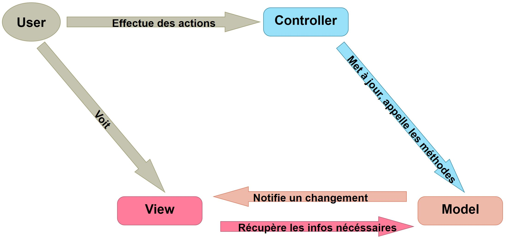

# ISI3 - MVC design pattern - "Game of Life"

> Le rapport est à fournir dans ce document sous chacune des questions.
> **Ne restez pas bloqués bêtement, demander de l'aide**
> Ne copier pas le code de votre voisin, ça se voit.

Nom/Prénom: `Ewald JANIN`

Lien du codesandbox: `https://codesandbox.io/s/strange-pare-jn58l`

> Pour générer un codesandbox associé à votre code, [suiver cette doc](https://codesandbox.io/docs/importing#import-from-github)

## Game of Life

Le jeu de la vie est un automate cellulaire qui répond à des règles très simple.
Il est inventé par [John Horton Conway](https://fr.wikipedia.org/wiki/John_Horton_Conway)(1937-2020).

## Avant-propos

1. Expliquer le design pattern MVC à l'aide d'un schéma à insérer directement ici.
   Utiliser un outils comme Dia pour le représenter. Je veux **votre** schéma, pas un de ceux qu'on peut trouver sur le net.

   

2. Expliquer ce pattern en complétant ce texte.

Le pattern MVC vise à découper le `modèle` de la `vue` et du `contrôleur` afin de rendre le code plus `clair`.
Les responsabilités ne sont alors plus `mixées` mais `réparties`.
On peut ainsi changer l'aspect visuel de son application sans pour autant impacter le `modèle`.

3. Expliquer dans quels cas on doit privilégier le pattern MVC.

Le design pattern MVC est assez répandu dans les applications Web. Il est très utile pour pouvoir modifier la vue sans toucher à la logique de l'application, ou inversement. Avec la bonne quantité d'abstraction et de polymorphisme, ce design pattern me paraît adapté pour une application dont on sait qu'elle va être amenée à évoluer. De plus, ce design pattern permet d'avoir plusieurs vues différentes à partir d'un même modèle. On pourrait choisir une vue à l'aide du contrôleur.

## A faire (obligatoire)

- Render le jeu fonctionel tout en respectant le design pattern MVC.
- Le bouton `start` doit lancer le jeu.
- Le bouton `stop` doit arrêter le jeu en l'état, le `start` relance le jeu.
- le bouton `reset` arrête le jeu et remet à la grille à l'état initial.

### Observer Observable

Afin de mettre à jour la vue à chaque nouvelle génération du jeu, la fonction `updated` doit notifier la view afin qu'elle se mette à jour.
En quoi cela relève du design pattern ObserverObservable.

1. Expliquer votre implémentation:

L'usage d'une callback permet ici de `notifier d'un changement` afin dire à la _View_ de se redessiner.
L'objet _Model_ n'a pas de lien avec `la vue` pourtant grâce à la `callback` il peut notifier la `vue, qui va mettre à jour l'affichage`.

2. Insérer ici un UML montrant le pattern Observer-Observable liés aux objects de ce TP.

   

## Optionel

> Si vous voulez apprendre d'autres choses

- Faire sorte de pouvoir changer les dimensions de la grille par in `<input/>` HTML.
- Faire en sorte de pouvoir modifier l'état d'une cellule en cliquant dessus.

## :warning: À rendre

- Une URL de codesandox pointant sur votre projet github afin que je puisse voir et tester le code.
- Le rapport complet.
